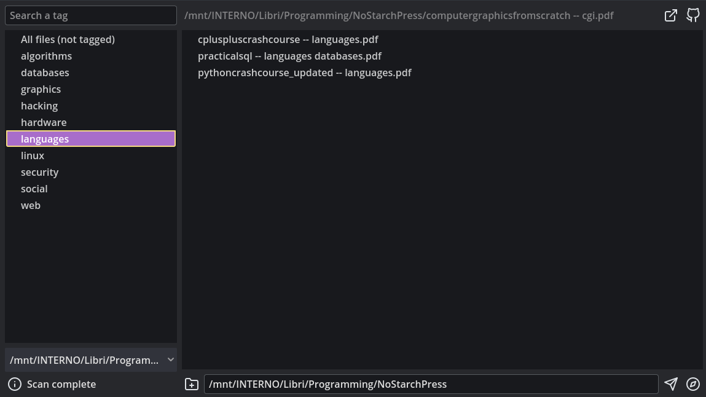

<div style="text-align: center">


# visualtags
Organize a chaotic directory 

<a href="#install">Install</a>
<span>&nbsp;&nbsp;-&nbsp;&nbsp;</span>
<a href="#usage">Usage</a>
<span>&nbsp;&nbsp;-&nbsp;&nbsp;</span>
<a href="#build">Build</a>
<span>&nbsp;&nbsp;-&nbsp;&nbsp;</span>
<a href="#others-projects">Others</a>
<span>&nbsp;&nbsp;-&nbsp;&nbsp;</span>
<a href="#internals">Internals</a>
<span>&nbsp;&nbsp;-&nbsp;&nbsp;</span>
<a href="#credits">Credits</a>




</div>

`visualtags` let you scan a directory recursively, list all the files, and organize them using tags, adding them directly to the file name (editing the file name guards against cross-platform problems and [vendor lock-in](https://en.m.wikipedia.org/wiki/Vendor_lock-in) effect). 

This projects is influenced by the work of [Karl Voit](https://karl-voit.at/) on [Personal Information Management](https://karl-voit.at/tags/pim/) (PIM).

Common errors can compromise the benefits of using a tags system. Read [How to use Tags](https://karl-voit.at/2022/01/29/How-to-Use-Tags/) to better understand how to use tags. An excerpt from the article:

	Use as few tags as possible.
	Limit yourself to a self-defined set of tags.
	Tags within your set must not overlap.
	By convention, tags are in plural.
	Tags are lower-case.
	Tags are single words.
	Keep tags on a general level.
	Omit tags that are obvious.
	Use one tag language.
	Explain your tags.

You can also read the PhD thesis by Karl Voit: TagTrees: [Improving Personal Information Management Using Associative Navigation](https://karl-voit.at/tags/pim/).

It explores the historical background of the current hierarchical file-based structure of most operating systems, the desk metaphor, the shortcomings of such system, and what a tag based structure can provide to get a better handle of your digital informations.

### Install
[⮤ Back to top](#visualtags)

1. Download the binary from the release page ([download](#))
2. Make the binary executable
```sh
chmod +x visualtags.x86_64
```
3. Execute it

### Usage
[⮤ Back to top](#visualtags)

1. Select a directory using the `Folder with plus icon`, or writing a path in the field
2. Press the `Compass icon` to know how much file will be scanned
3. Press the `Arrow icon` to start the directory scan
> By default, some common messy directories are excluded during the scan process. Some are: /node_modules, /installer_files, /dist, /build, etc.

4. A list, of the files recursively found, will be displayed
5. Select a file and edit the tag field

### Internals
[⮤ Back to top](#visualtags)
The current implementetion doesn't watch the changes happening outside visualtags. 

It scans the folders and displays a static list of files, that when edited will edit the file on the file system. Than, the directory is recursively re-scanned, and the files list updated.

In a very large directory (>10000 files), the first scan can be >10 seconds long. The next scans will be much faster since the kernel caches the directories acceses.

The software is optimized to be used keyboard only, and the overall workflow, in the end, is fast enough.

### Build
[⮤ Back to top](#visualtags)

1. Clone the repo
```sh
git clone https://github.com/plucafs/visualtags
```
2. Open Godot (4.3), click on the Import button and then select the `project.godot` file from the cloned directory
3. Export the project
	- Click on Project in the menu bar
	- Click on Export
	- Click on Add...
	- Select the platform
		- Install the templates (if it's your first export)
	- Click Export project...
	- Select the destination directory
	- The executable will be created

### Others projects
[⮤ Back to top](#visualtags)
- [filetags]( https://github.com/novoid/filetags) by novoid

- [tagspaces](https://github.com/tagspaces/tagspaces) by tagspaces

- [TagStudio](https://github.com/TagStudioDev/TagStudio) by TagStudioDev

### Credits
[⮤ Back to top](#visualtags)

- Made with [Godot](https://godotengine.org/) 4.3
- Icons by [Feather Icons](https://github.com/feathericons/feather)
